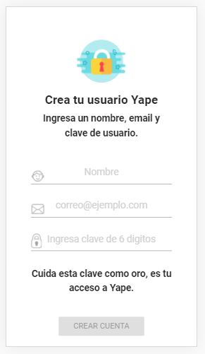
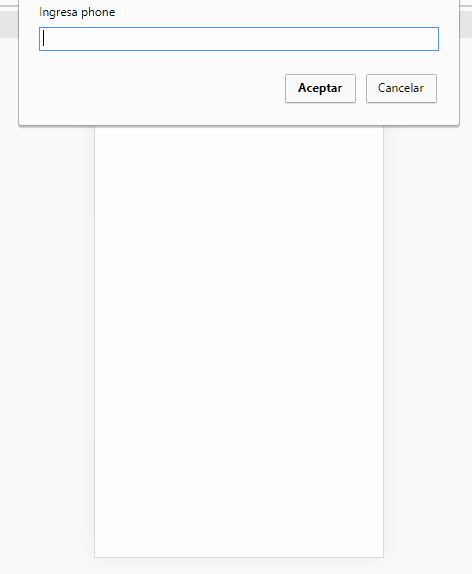

# yape

**Cada cosa paja por hacer empieza con un yape**    

+ Yape es una aplicación para realizar pagos entre personas y a comercios de manera fácil, rápida, confiable y sin ningún costo.

## Registro de usuario

+ Tercera fase en el registro a Yape.   
+ Por ser una fase avanzada del registro, obtenemos el número de celular mediante un **prompt**
+ Validacione: Nombre, correo electrónico y clave.
+ El botón  sólo se activa cuando el usuario llena todos los datos.

+ Al hacer click en  se envían los datos a la API y pasa a la pantalla **check**

`$.post('/api/createUser',{
  phone : state.user.phone,
  name : nombre.val(),
  email : email.val(),
  password : password.val()
}`

## Check

+ Muestra el éxito del regitro de usuario.
+ Se muestra durante 3 segundos y pasa a la siguienta pantalla.

## Librerias externas

+ [Jquery](https://jquery.com/)

## Frameworks CSS

+ [Materialize](http://materializecss.com/)
